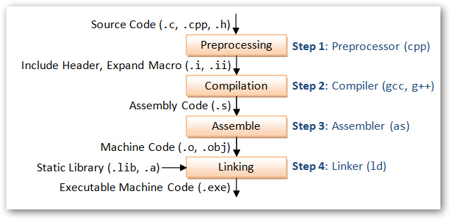

&emsp;&emsp;托管DLL和非托管DLL的区别：狭义解释讲，托管DLL就在Dotnet环境生成的DLL文件；非托管DLL不是在Dotnet环境生成的DLL文件。
&emsp;&emsp;托管DLL文件，可以在Dotnet环境通过 “添加引用” 的方式，直接把托管DLL文件添加到项目中，然后通过 Using DLL命名空间，来调用相应的DLL对象；非托管DLL文件，在Dotnet环境应用时，通过DllImport 调用。
<!--more-->

### 概述
&emsp;&emsp;托管dll虽然符合windows的PE格式规范，但是代码是以IL的形式保存在.Text 区的，而不是机器码，CLR会在运行时JIT编译成机器码再交给操作系统执行，这也就为什么托管代码称之为”托管”的意义。
&emsp;&emsp;所以，要想注入托管dll，首先需要在目标进程中启动CLR，然后让CLR来加载managed dll。
&emsp;&emsp;托管DLL，指完全由.NET托管代码实现的DLL，完全依赖于 .NET 平台的 CLR 运行。托管DLL，受.NET CLR管控，支持内存自动回收等的，对于.NET平台是安全DLL
&emsp;&emsp;非托管DLL，是指完全或者部分 不是用.NET代码实现，不依赖于.NET平台即可运行，例如 COM方式 的DLL，不支持自动回收内存，对于.NET平台而言，也是非安全可控的。

------------------
&emsp;&emsp;正常编程所用的高级语言，是无法被计算机识别的。需要先将高级语言翻译为机器语言，才能被机器理解和运行。
在标准C/C++中，编译过程是这样的：

&emsp;&emsp;源代码首先经过预处理器，对头文件以及宏进行解析，然后经过编译器，生成汇编代码，接着，经过汇编，生成机器指令，最后将所有文件连接起来。这种编译方式的优点在于，最终直接生成了机器码，可以直接被计算机识别和运行，无需任何中间运行环境，但缺点也在于，由于不同平台能够识别的机器码不同，因此程序的跨平台能力较差。
&emsp;&emsp;而在Java语言中，源代码并没有被直接翻译成机器码，而是编译成了一种中间代码（字节码Bytecode）。因此，运行Java程序需要一个额外的JRE（Java Runtime Enviromental）运行环境，在JRE中存在着JVM（Java Virtual Mechinal，Java虚拟机），在程序运行的时候，会将中间代码进一步解释为机器码，并在机器上运行。
&emsp;&emsp;使用中间代码的好处在于，程序的跨平台性比较好，一次编译，可以在不同的设备上运行。
&emsp;&emsp;托管/非托管是微软的.net framework中特有的概念，其中，非托管代码也叫本地（native）代码。与Java中的机制类似，也是先将源代码编译成中间代码（MSIL，Microsoft Intermediate Language），然后再由.net中的CLR将中间代码编译成机器代码。
&emsp;&emsp;而C#与Java的区别在于，Java是先编译后解释，C#是两次编译。

----------------

### 调用DLL中的非托管函数一般方法

首先，应该在C#语言源程序中声明外部方法，其基本形式是：
    [DLLImport(“DLL文件”)]
修饰符 extern 返回变量类型 方法名称 （参数列表）
其中：
> DLL文件：包含定义外部方法的库文件。
修饰符： 访问修饰符，除了abstract以外在声明方法时可以使用的修饰符。
返回变量类型：在DLL文件中你需调用方法的返回变量类型。
方法名称：在DLL文件中你需调用方法的名称。
参数列表：在DLL文件中你需调用方法的列表。

注意：需要在程序声明中使用System.Runtime.InteropServices命名空间。
DllImport只能放置在方法声明上。
DLL文件必须位于程序当前目录或系统定义的查询路径中（即：系统环境变量中Path所设置的路径）。
<font color="#FF0000">**返回变量类型、方法名称、参数列表一定要与DLL文件中的定义相一致。**</font>
若要使用其它函数名，可以使用EntryPoint属性设置，如：
```csharp
[DllImport("user32.dll", EntryPoint="MessageBoxA")]
static extern int MsgBox(int hWnd, string msg, string caption, int type);

[DllImportAttribute("CN210S_CSM_LV1.dll", EntryPoint = "uds_calc_key", CharSet = CharSet.Ansi)]
private static extern void uds_calc_key_ldw(string seed, StringBuilder key);
```
其它可选的 DllImportAttribute 属性：
> CharSet： 指示用在入口点中的字符集，如：CharSet=CharSet.Ansi；
SetLastError： 指示方法是否保留 Win32"上一错误"，如：SetLastError=true；
ExactSpelling： 指示 EntryPoint 是否必须与指示的入口点的拼写完全匹配，如：ExactSpelling=false；
PreserveSig： 指示方法的签名应当被保留还是被转换， 如：PreserveSig=true；
CallingConvention： 指示入口点的调用约定， 如：CallingConvention=CallingConvention.Winapi；
